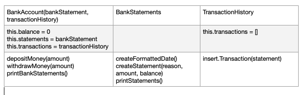
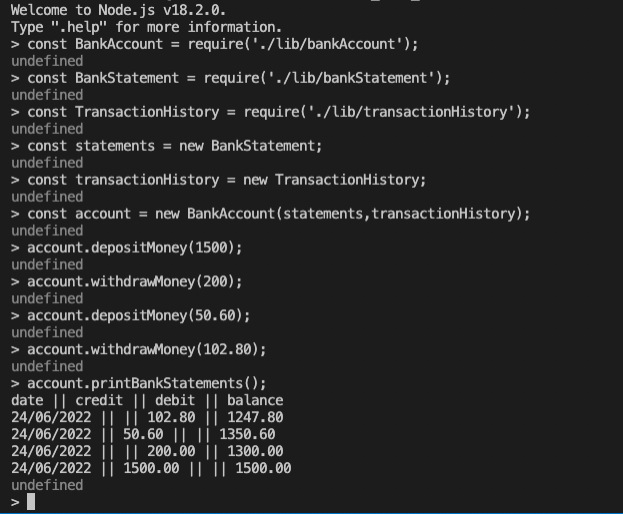

# Bank_tech_test (Javascript)

The purpose of the exercise is to create an interactive bank account. The language chosen in this case was JavaScript.

## Requirements

* You should be able to interact with your code via a REPL like IRB or Node. (You don't need to implement a command line interface that takes input from STDIN.)
* Deposits, withdrawal.
* Account statement (date, amount, balance) printing.
* Data can be kept in memory (it doesn't need to be stored to a database or anything).

## Acceptance criteria

**Given** a client makes a deposit of 1000 on 10-01-2023  
**And** a deposit of 2000 on 13-01-2023  
**And** a withdrawal of 500 on 14-01-2023  
**When** she prints her bank statement  
**Then** she would see

```
date || credit || debit || balance
14/01/2023 || || 500.00 || 2500.00
13/01/2023 || 2000.00 || || 3000.00
10/01/2023 || 1000.00 || || 1000.00
```

## CRC cards



## Approach

It was decided to create 3 classes:
* **BankAccount**, which will take care of the balance and methods related to change this value (deposit, withdraw). It has injected the 2 other classes
* **BankStatements**, which will work as a 'statement generator' (same instance can be used by several accounts). Transactions should include the date they happened in the required format (check 'acceptance criteria')
* **TransactionHistory**, which will store the transactions from one account and provide them to BankStatements class when printing them

## Getting started

Install Node Version Manager (nvm).

Install node:
```
nvm install node
nvm use node
```
Install dependencies:

```
npm install
```

## Usage

On node, require BankAccount class:
```
const BankAccount = require('./lib/bankAccount');
```
Require BankStatement class:
```
const BankStatement = require('./lib/bankStatement');
```
Require Transaction History class:
```
const TransactionHistory = require('./lib/transactionHistory');
```
Create an instance of BankStatement:
```
const statements = new BankStatement;
```
Create an instance of TransactionHistory:
```
const transactionHistory = new TransactionHistory;
```
Create a new bank account:
```
const account = new BankAccount(statements, transactionHistory);
```
Call `account.depositMoney(amount)` to deposit money, `account.withdrawMoney(amount)` to withdraw money and `account.printBankStatements()` to print the statements.

## Example usage



## Running tests

Run `jest` on terminal when on main folder.

To include code coverage, run `jest --coverage` instead.